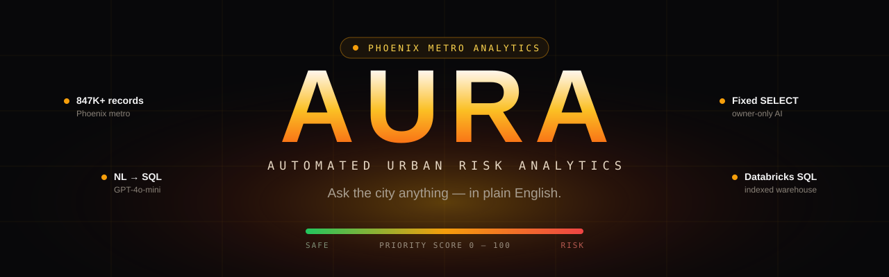
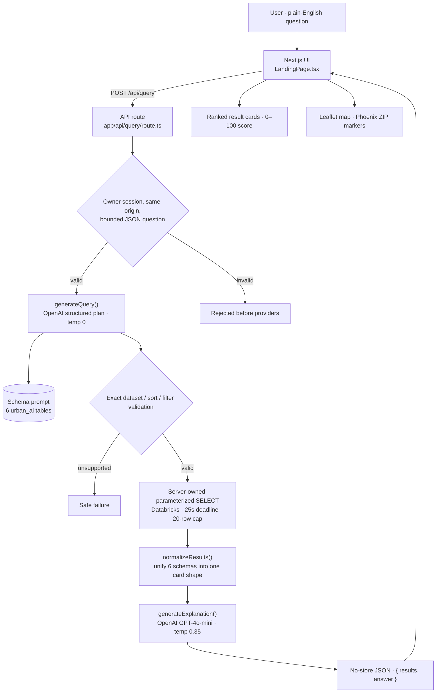
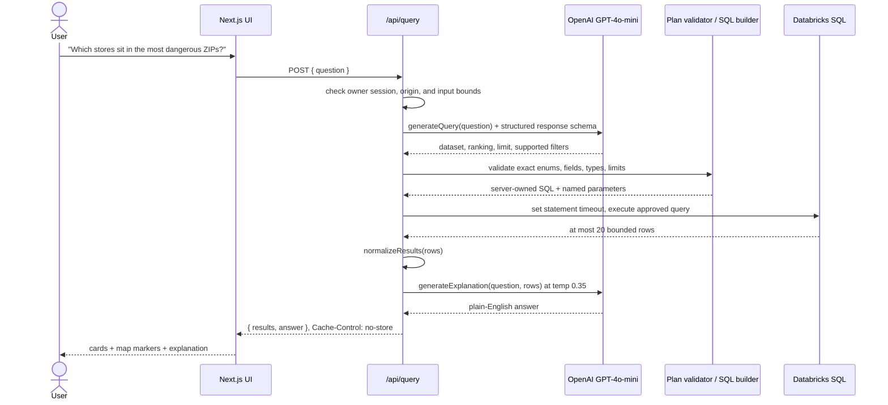
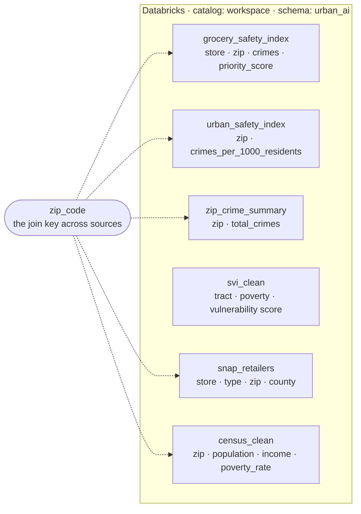
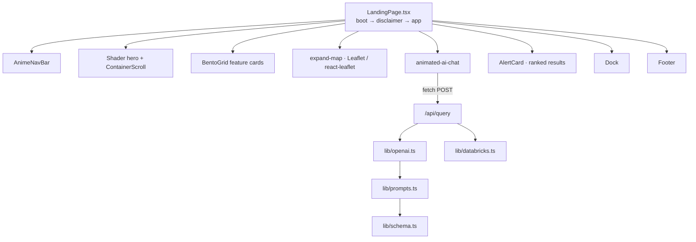

<p align="center">
  
</p>

<p align="center">
  <a href="https://urban-ai-agent.vercel.app/"></a>
  
  
  
  
  
  
</p>

<p align="center">
  <b>Ask a city safety question in plain English. Get back real data, a map, and a straight answer.</b><br>
  AURA turns natural language into governed SQL, runs it over ~847K indexed Phoenix-metro records, and explains what came back.
</p>

<p align="center">
  <a href="https://urban-ai-agent.vercel.app/"><b>► Try the live app</b></a>
</p>

---

## Contents

- [What AURA does](#what-aura-does)
- [Why I built it](#why-i-built-it)
- [Ask it things like this](#ask-it-things-like-this)
- [How it works](#how-it-works)
- [The request lifecycle](#the-request-lifecycle)
- [The data behind it](#the-data-behind-it)
- [How the frontend is wired](#how-the-frontend-is-wired)
- [Engineering decisions worth calling out](#engineering-decisions-worth-calling-out)
- [Tech stack](#tech-stack)
- [Project structure](#project-structure)
- [Run it locally](#run-it-locally)
- [Safety, on purpose](#safety-on-purpose)
- [What I'd build next](#what-id-build-next)
- [Data sources & credits](#data-sources--credits)
- [License](#license)
- [Contact](#contact)

---

## What AURA does

**AURA** (Automated Urban Risk Analytics) is a natural-language analytics tool for urban safety data. You type a question the way you'd ask a friend — *"which grocery stores sit in the most dangerous ZIP codes?"* — and AURA does three things:

1. **Plans** your question as a structured dataset, ranking, and supported filters. The server validates that plan and builds a parameterized `SELECT` from fixed templates.
2. **Runs** that query against a Databricks SQL warehouse holding crime, census, vulnerability, and food-access data for the Phoenix metro area.
3. **Explains** the result in plain English and plots the relevant ZIP codes on a live map — no dashboards to learn, no SQL to write.

It covers **320+ Phoenix-metro ZIP codes** across **six indexed tables**. The public interface remains visible; paid AI and warehouse queries require private owner access. The query builder only emits reads from those six datasets. A dedicated Databricks principal with SELECT-only grants is still required to enforce the same boundary in the warehouse.

> AURA is experimental research software. Risk scores are statistical approximations — not a basis for law enforcement, policy, or operational decisions. The app says so on the way in, and so do I.

---

## Why I built it

Most "city data" lives in places normal people never look: open-data CSVs, census tables, vulnerability indices with column names like `RPL_THEMES` and `EP_UNINSUR`. The information is *public*, but it isn't *accessible* — you need SQL and patience to get a single answer out of it.

I wanted to collapse that gap. The interesting problem wasn't the dashboard; it was the middle layer: **can a language model reliably turn a vague human question into correct, safe SQL across six differently-shaped tables, and then hand the numbers back as something a person actually understands?** Getting that to behave — without it inventing columns, joining tables that shouldn't be joined, or running anything destructive — is what this project is really about.

The Phoenix metro area was a good testbed: rich open data, real variation between neighborhoods, and a clear use case (where are people most exposed, and where is help hardest to reach).

---

## Ask it things like this

Examples supported by the query planner after unlocking Owner access:

- *Which grocery stores are in the most dangerous ZIP codes?*
- *Show the top 5 highest-risk locations in Phoenix.*
- *Which ZIP codes have the lowest crime per resident?*
- *Find stores with high population but low crime scores.*
- *Rank ZIP codes by crime density.*
- *Which census tracts have the highest social vulnerability?*

Each one returns ranked result cards, the underlying ZIPs pinned on a map, and a short written read on what it means.

> The planner supports single-dataset rankings, exact city filters where available, ZIP filters, and population ranges, with up to 20 results. Joins, arbitrary calculations, and SQL supplied by the user or model are not supported. A cold warehouse may need to warm up before a query succeeds.

---

## How it works

A question makes one round trip through a single API route. Authentication, origin, and bounded JSON validation run before any paid call. The model proposes structured intent; the server validates every field and constructs SQL from fixed identifiers and bound values.



The app has no question-history database and does not log questions, generated SQL, or model output. Questions and a limited result preview are sent to OpenAI, and SQL with bound filters is sent to Databricks. Those providers and hosting infrastructure can retain data according to their account settings; app-side non-persistence is not a promise of zero provider retention.

---

## The request lifecycle

The model is used twice: once to plan the query, then to explain the bounded results.



Model-generated SQL is never executed. Catalog, schema, tables, columns, sort expressions, and comparison operators come from server code. City names, ZIPs, population ranges, and the row limit are passed as named parameters. Unsupported datasets, fields, extra properties, and result limits fail validation.

---

## The data behind it

Six tables live under the `urban_ai` schema in Databricks. They come from different real-world sources and have wildly different shapes — the trick is that `zip_code` quietly ties most of them together, and the prompt tells the model exactly which table answers which kind of question.



Because every table scores risk on its own scale (raw `priority_score` runs from `0.17` to about `3030`, vulnerability is a `0–1` index, crime is a raw count), the API normalizes everything into one consistent `0–100` card. Priority scores in particular go through a **log scale** so the mid-range isn't all squashed at the bottom — `0.17 → 0`, `139 → 53`, `858 → 79`, `3030 → 100`. That normalizer is the single most important function in the codebase: it's what lets six schemas render as one clean list.

| Table | Answers questions about | Key columns |
|---|---|---|
| `grocery_safety_index` | which stores sit in safe vs. dangerous areas | `store_name`, `zip_code`, `total_crimes`, `priority_score` |
| `urban_safety_index` | ZIP-level risk, corridors, infrastructure | `zip_code`, `crimes_per_1000_residents` |
| `zip_crime_summary` | raw crime counts per ZIP | `zip_code`, `total_crimes` |
| `svi_clean` | poverty, unemployment, uninsured, vulnerability | `EP_POV150`, `EP_UNEMP`, `EP_UNINSUR`, `RPL_THEMES` |
| `snap_retailers` | food access and food deserts | `Store Name`, `Store Type`, `Zip Code` |
| `census_clean` | population, income, housing | `zip_code`, `population`, `median_income`, `poverty_rate` |

---

## How the frontend is wired

The landing page is a small state machine — `boot → disclaimer → app` — composed from a set of focused UI components. The chat is the only thing that talks to the backend.



The map isn't decorative: AURA carries a lookup of ~150 Phoenix-metro ZIP centroids, so any ZIP that shows up in a result lands as a real marker on the map.

---

## Engineering decisions worth calling out

| Decision | Why |
|---|---|
| **Schema-aware structured intent** | The model can choose only a supported dataset and bounded filters; server templates own the actual SQL. Adding a dataset requires both prompt metadata and an approved template. |
| **Private paid execution** | A random owner access code creates a signed one-hour HttpOnly session. Authorization and same-origin checks run before reading query bodies or contacting providers. Missing configuration fails closed. |
| **Bounded provider work** | Model outputs have token caps and no automatic retries. Warehouse execution has a 25-second statement timeout, a 20-row result cap, and bounded result validation. |
| **A fresh Databricks client per request** | Operation, session, and client teardown are attempted within bounded deadlines. Late handles are closed if a request has already timed out. |
| **One normalizer, six schemas** | `normalizeResults()` detects which table a row came from and maps it onto a single card shape, so the frontend only ever renders one thing. |
| **No JOINs, no subqueries** | Server-owned templates have no joins, subqueries, model-generated expressions, or arbitrary functions. |

---

## Tech stack

| Layer | Choice |
|---|---|
| Framework | Next.js 16 (App Router) + React 19 |
| Language | TypeScript |
| Styling / motion | Tailwind CSS v4, Framer Motion (`motion`) |
| Maps | Bundled Leaflet |
| AI | OpenAI GPT-4o-mini |
| Data warehouse | Databricks SQL (`@databricks/sql`) |
| Icons | lucide-react |
| Hosting | Vercel |

---

## Project structure

```text
urban-ai-agent/
├── app/
│   ├── api/query/route.ts     # authorize -> validate -> plan -> compile -> run -> explain
│   ├── api/owner-session/    # private one-hour owner sessions
│   ├── layout.tsx             # metadata, fonts
│   └── page.tsx               # renders <LandingPage />
├── src/
│   ├── components/
│   │   ├── LandingPage.tsx    # boot -> disclaimer -> app state machine
│   │   └── ui/                # navbar, hero shader, bento grid, map, chat, dock, footer
│   └── lib/
│       ├── openai.ts          # structured plan, explanation, normalization
│       ├── databricks.ts      # connect, run, tear down per request
│       ├── owner-auth.ts      # server-only authentication and signed sessions
│       ├── query-plan.ts      # fixed SQL templates and bound filters
│       ├── request-validation.ts # bounded JSON input
│       ├── map-popup.ts       # text-only popup DOM
│       ├── prompts.ts         # planner + explanation prompts
│       ├── schema.ts          # the six-table schema the model reads
│       └── types.ts
├── public/                    # video background, icons
└── docs/assets/               # README art
```

---

## Run it locally

You'll need Node.js 20 or newer, a Databricks SQL warehouse, an OpenAI API key, and a cryptographically random owner access code.

```bash
git clone https://github.com/zshah101/urban-ai-agent.git
cd urban-ai-agent
npm install
```

Create a `.env.local` in the project root:

```bash
OPENAI_API_KEY=sk-...
DATABRICKS_HOST=your-workspace.cloud.databricks.com
DATABRICKS_HTTP_PATH=/sql/1.0/warehouses/xxxxxxxxxxxx
DATABRICKS_TOKEN=dapi-...
# Generate a random value of at least 32 URL-safe characters. Never commit it.
AI_OWNER_ACCESS_CODE=replace-with-a-cryptographically-random-value
```

Then:

```bash
npm run dev
```

Open [http://localhost:3000](http://localhost:3000) and use **Owner access** above the terminal. The placeholder access code is deliberately rejected. Keep credentials in `.env.local` locally and server-only environment variables when deploying; never prefix them with `NEXT_PUBLIC_`. Provider keys stay out of browser code, but are sent to the configured provider over HTTPS when authenticating server requests.

> AURA expects the six tables above under `workspace.urban_ai`. Update both `src/lib/schema.ts` and the approved templates in `src/lib/query-plan.ts` when changing the schema. Give a dedicated service principal SELECT access only to those public-data tables/views. Configure provider spending limits, warehouse auto-stop/size, and deployment protection for old preview deployments separately; private app access is not a distributed cost quota.

---

## Safety, on purpose

This is a tool that talks about crime and vulnerability, so the guardrails aren't an afterthought:

- **Private AI access** — signed, expiring owner cookies; no access-code storage in browser storage or URLs.
- **Approved SQL templates** — six datasets, fixed identifiers, named parameters, and enforced result limits. Warehouse permissions remain a separate required boundary.
- **Privacy-aware processing** — no application query/output logs or history database; provider and hosting retention still depends on account settings.
- **Text-only map popups** — returned strings are displayed through DOM text nodes. Leaflet is bundled with the app instead of loaded as a remote script.
- **Offline verification** — `npm run test:security` uses provider stubs to exercise authorization, planner validation, bounded cleanup, safe errors, and popup handling without real credentials or paid requests.
- **An honest front door** — the app opens with a disclaimer that says, plainly, that it's experimental and *not* for law enforcement, policy decisions, or public-safety determinations. I'd rather under-promise.

---

## What I'd build next

- **Query caching** so the same question doesn't re-hit the warehouse (and so the cold cluster gets warm-started behind a tiny cache).
- **Confidence + provenance** on each answer — show which table and rows produced it, inline.
- **More cities.** The architecture is city-agnostic; the only city-specific pieces are the schema and the ZIP centroid map.
- **An evals harness** — a fixed set of questions with expected SQL, run on every deploy, so prompt tweaks can't silently regress.
- **Streaming explanations** instead of waiting for the full completion.

---

## Data sources & credits

AURA indexes open public datasets for the Phoenix metro area:

- **Crime incident data** — City of Phoenix open data
- **US Census** — population, income, poverty (American Community Survey)
- **Social Vulnerability Index** — CDC/ATSDR SVI (`EP_*`, `RPL_THEMES` fields)
- **SNAP authorized retailers** — USDA SNAP Retailer Locator
- **Grocery / store locations** — joined to crime by ZIP

All datasets are public; AURA only reads indexed copies.

---

## License

Released under the [MIT License](LICENSE).

---

## Contact

**Zain Sahir Shah**

[](https://linkedin.com/in/zain-sahir-s-4b1a9a227)
[](https://github.com/SikeTheMike)
[](mailto:shahzain.zeza@gmail.com)

If you're reading the code and something's unclear, open an issue or reach out — always happy to walk through it.
